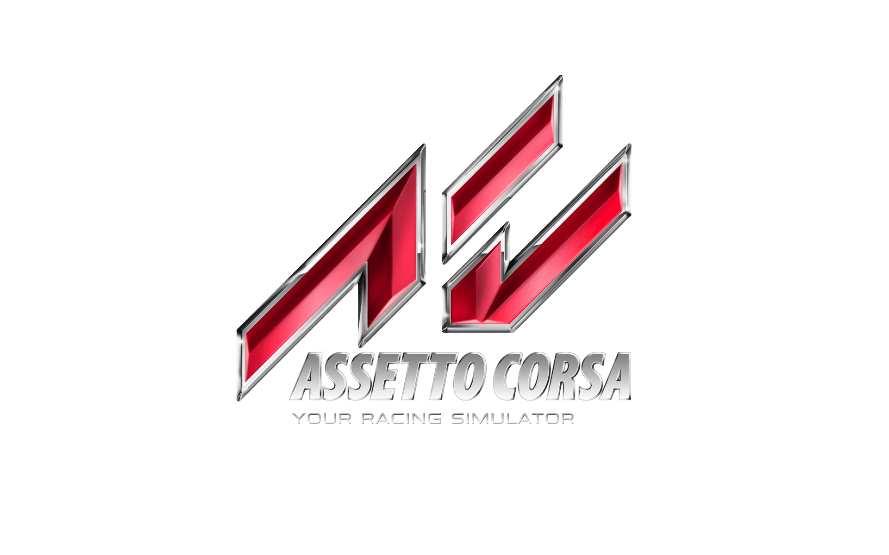

# Asseto Corsa Server Creator CLI


Tool for automatically generate pressets for Asseto Corsa servers.

For help on how to use this tool, in the command line, run:

```bash
python3 acsc.py -h
#or 
python3 acsc.py --help
```


*Note*: This tool is fan-made and not affiliated with Kunos Simulazioni in any way.

